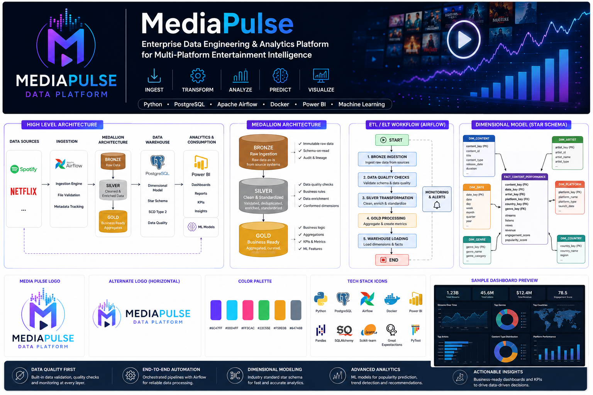
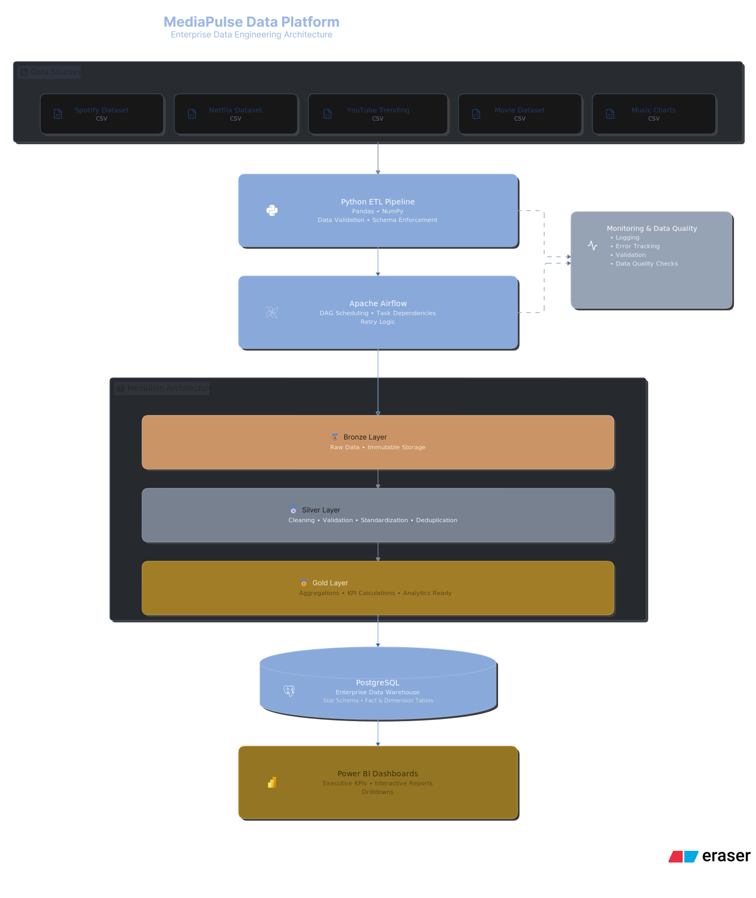
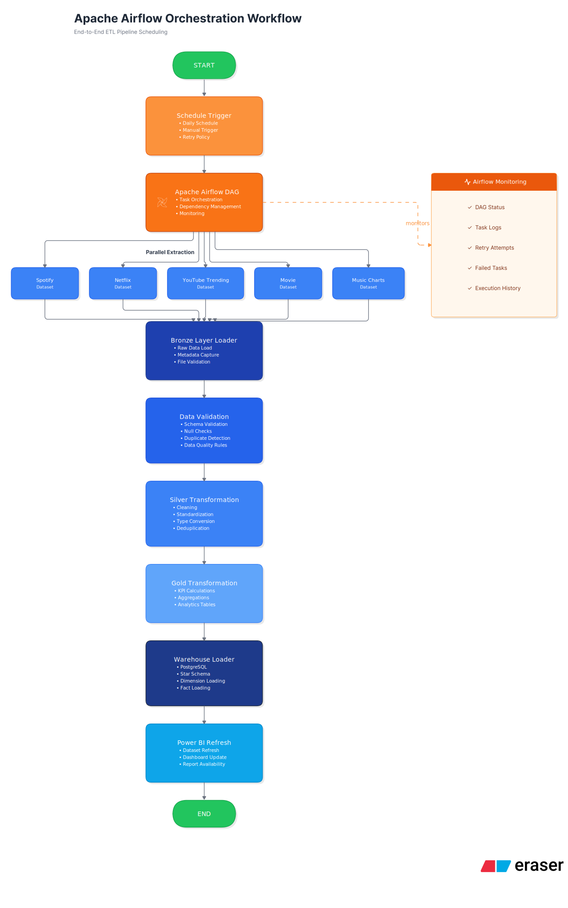
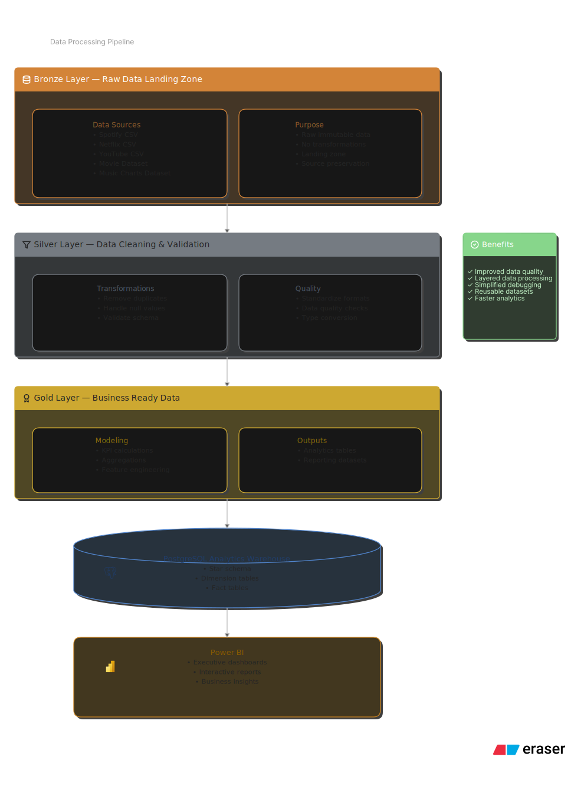
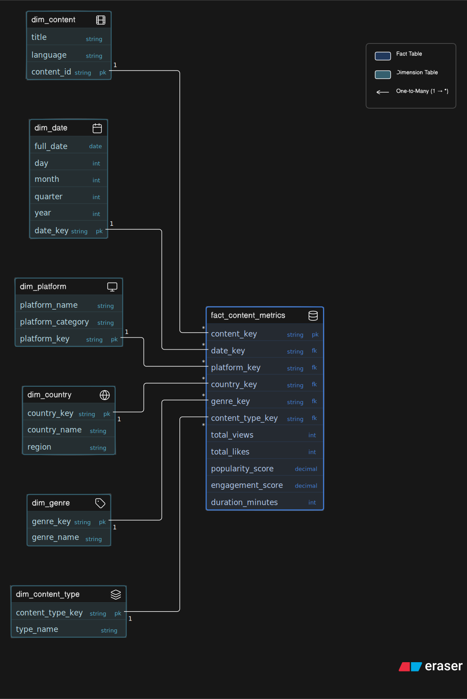

# MediaPulse Data Platform

  

<h3 align="center">
Enterprise Data Engineering & Analytics Platform for Multi-Platform Entertainment Intelligence
</h3>

---

## Overview

MediaPulse Data Platform is an enterprise-style data engineering project that demonstrates the complete lifecycle of modern analytical data processing—from raw data ingestion to business-ready dashboards.

The platform ingests entertainment datasets from multiple sources, validates and standardizes incoming data, applies Medallion Architecture transformations (Bronze, Silver, and Gold), loads curated datasets into a PostgreSQL dimensional warehouse, and prepares analytics-ready data for business intelligence using Power BI.

Rather than being a simple ETL pipeline, the project is designed to showcase production-inspired engineering practices including orchestration, modular architecture, testing, monitoring, data quality validation, and warehouse design.

---

## Business Problem

Entertainment platforms generate data from multiple independent systems.

These datasets often contain:

* Different schemas
* Missing values
* Duplicate records
* Inconsistent genre names
* Different date formats
* Platform-specific metadata

Without proper engineering, analysts spend significant time cleaning data instead of generating business insights.

MediaPulse solves this problem by building a reusable, automated analytics platform that transforms raw entertainment data into trusted, analytics-ready datasets.

---

## Business Objectives

The platform enables organizations to:

* Build reliable ETL pipelines
* Standardize heterogeneous datasets
* Improve data quality before analysis
* Create a scalable dimensional warehouse
* Generate executive KPIs
* Support business intelligence dashboards
* Prepare data for future machine learning workloads

---

## Key Features

* End-to-End ETL Pipeline
* Medallion Architecture (Bronze → Silver → Gold)
* PostgreSQL Dimensional Data Warehouse
* Apache Airflow Workflow Orchestration
* Automated Data Quality Validation
* Metadata Tracking
* Data Lineage Support
* Incremental Loading Framework
* Warehouse Monitoring
* Modular Python Architecture
* Automated Testing with PyTest
* Docker Support
* Power BI Integration
* Analytics-ready Data Models
* Feature Engineering Foundation for Machine Learning

---

## Architecture

MediaPulse Data Platform follows a layered enterprise data architecture inspired by modern analytics platforms used across media and entertainment organizations. The platform separates ingestion, transformation, orchestration, storage, and analytics into independent layers to improve scalability, maintainability, and data quality.

The architecture is built around the Medallion Architecture (Bronze, Silver, Gold), orchestrated with Apache Airflow and backed by a PostgreSQL dimensional warehouse.

---

## System Architecture

The platform ingests entertainment datasets from multiple sources, processes them through a modular ETL pipeline, stores analytics-ready datasets in a PostgreSQL dimensional warehouse, and exposes business insights through Power BI dashboards.

### Architecture Highlights

* Multi-source batch data ingestion
* Layered Medallion Architecture
* Metadata-driven ETL
* Automated validation and quality checks
* Modular transformation pipeline
* PostgreSQL star-schema warehouse
* Workflow orchestration using Apache Airflow
* Analytics-ready Power BI integration

---

## End-to-End Data Flow

The MediaPulse pipeline follows a structured flow to ensure raw entertainment data is transformed into trusted business intelligence.

### Pipeline Stages

**1. Data Sources**

Entertainment datasets are collected from multiple publicly available platforms including Spotify, Netflix, YouTube, Movies, and Music Charts.

**2. Data Ingestion**

The ingestion engine validates files, records metadata, verifies checksums, and prepares raw datasets for downstream processing.

**3. Bronze Layer**

Raw data is preserved in its original structure while ingestion metadata and validation information are captured.

**4. Silver Layer**

Business rules, schema validation, standardization, deduplication, null handling, and quality checks produce clean analytical datasets.

**5. Gold Layer**

Business metrics, KPIs, aggregations, feature engineering, recommendation features, and executive analytics are generated.

**6. Data Warehouse**

Curated datasets are loaded into a PostgreSQL dimensional warehouse optimized for analytical queries.

**7. Business Intelligence**

Power BI consumes warehouse tables to produce interactive executive dashboards and analytical reports.

---

## Medallion Architecture

MediaPulse adopts the Medallion Architecture to progressively improve data quality while maintaining traceability throughout the ETL lifecycle.

### Bronze Layer

Purpose:

* Preserve raw source data
* Capture ingestion metadata
* Validate incoming datasets
* Archive original files
* Enable reproducibility

Primary Modules

* Bronze Loader
* Metadata Writer
* Validation Services

---

### Silver Layer

Purpose:

* Standardize schemas
* Clean invalid records
* Remove duplicates
* Handle missing values
* Apply business rules
* Improve overall data quality

Primary Modules

* Standardizer
* Deduplicator
* Schema Validator
* Genre Mapper
* Date Standardizer
* Null Handler
* Quality Engine

---

### Gold Layer

Purpose:

* Generate business KPIs
* Produce analytical datasets
* Create feature engineering outputs
* Support dashboard reporting
* Prepare machine learning features

Primary Modules

* Executive KPIs
* Revenue Metrics
* Trend Intelligence
* Recommendation Features
* Dashboard Products
* Feature Store

---

## Data Warehouse Design

The analytical warehouse follows a dimensional star schema designed to optimize reporting performance while simplifying business analysis.

### Fact Table

**Fact_Content_Performance**

Stores measurable business events and performance metrics used for reporting and analytics.

---

### Dimension Tables

* Dim_Artist
* Dim_Genre
* Dim_Country
* Dim_Platform
* Dim_Date
* Dim_Content

These dimensions provide descriptive context for analytical queries while reducing redundancy and improving query performance.

---

### Why a Star Schema?

MediaPulse uses a star schema because it:

* Simplifies analytical queries
* Improves Power BI performance
* Reduces join complexity
* Supports scalable business reporting
* Aligns with enterprise data warehouse best practices

---

## Technology Stack

| Layer                       | Technologies                      |
| --------------------------- | --------------------------------- |
| Programming Language        | Python 3                          |
| Data Processing             | Pandas, NumPy                     |
| Database                    | PostgreSQL                        |
| Data Warehouse              | Dimensional Star Schema           |
| Workflow Orchestration      | Apache Airflow                    |
| Data Quality                | Custom Validation Framework       |
| Machine Learning Foundation | Scikit-learn, Feature Engineering |
| Containerization            | Docker                            |
| Testing                     | PyTest                            |
| Version Control             | Git & GitHub                      |
| Business Intelligence       | Power BI                          |
| SQL                         | PostgreSQL                        |

---

## Architectural Principles

MediaPulse was designed around several engineering principles commonly used in enterprise data platforms:

* Modular and reusable ETL components
* Separation of ingestion, transformation, and analytics
* Layered data quality enforcement
* Metadata-driven processing
* Scalable dimensional warehouse design
* Automated workflow orchestration
* Testable and maintainable codebase
* Business-focused analytics delivery

---

## Technology Stack

| Category         | Technologies                |
| ---------------- | --------------------------- |
| Programming      | Python                      |
| Database         | PostgreSQL                  |
| Data Processing  | Pandas, NumPy               |
| Orchestration    | Apache Airflow              |
| Data Quality     | Custom Validation Framework |
| Testing          | PyTest                      |
| Containerization | Docker                      |
| Version Control  | Git & GitHub                |
| Visualization    | Power BI                    |
| SQL              | PostgreSQL                  |

---

## Current Project Status

| Component              | Status         |
| ---------------------- | -------------- |
| Data Ingestion         | ✅ Complete     |
| Bronze Layer           | ✅ Complete     |
| Silver Layer           | ✅ Complete     |
| Gold Layer             | ✅ Complete     |
| PostgreSQL Warehouse   | ✅ Complete     |
| Airflow Pipelines      | ✅ Complete     |
| Data Quality Framework | ✅ Complete     |
| Automated Testing      | ✅ Complete     |
| Documentation          | 🚧 In Progress |
| Power BI Dashboard     | 🚧 In Progress |

---

## Repository Structure

> Repository structure documentation will be expanded with architecture diagrams and implementation details.

---

## Documentation Roadmap

The following sections will be added as the project documentation progresses:

* System Architecture
* Medallion Architecture
* ETL Pipeline Walkthrough
* Airflow Orchestration
* PostgreSQL Warehouse Design
* Star Schema
* SQL Analytics
* Power BI Dashboard
* Testing Strategy
* Deployment Guide
* Engineering Decisions
* Production Readiness
* Lessons Learned
* Future Enhancements

---

## Project Vision

MediaPulse is designed as a portfolio project that demonstrates enterprise data engineering principles commonly used in modern analytics platforms.

The long-term roadmap includes support for cloud-native deployment, streaming ingestion, infrastructure as code, and advanced analytics capabilities while maintaining a strong focus on software engineering best practices.

---

> **This README is actively being expanded as the project reaches production-ready status.**
