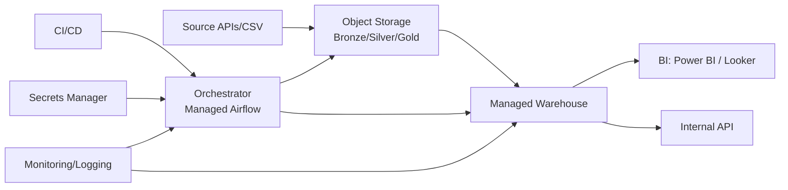
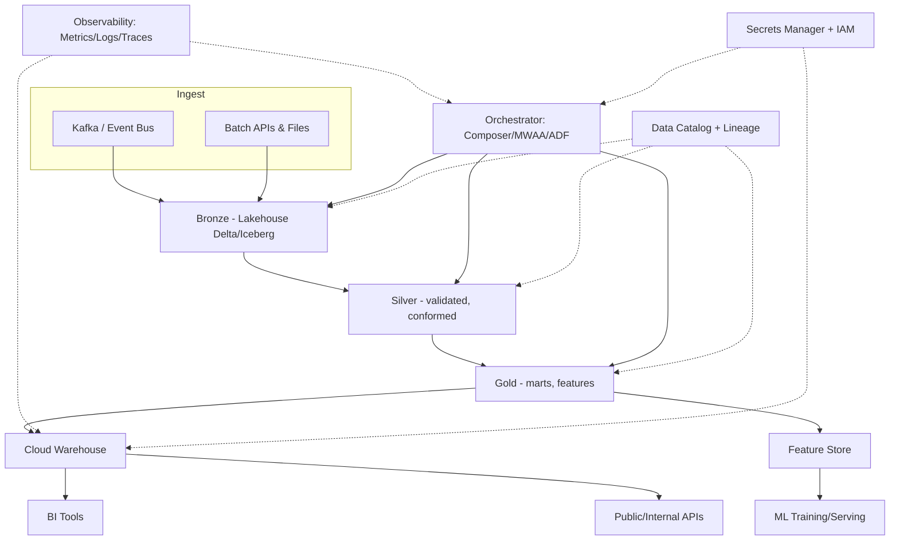

# MediaPulse Data Platform — Engineering Audit & Growth Roadmap

**Audit date:** 2026-07-17
**Auditor stance:** Treated as a repository submitted for a Senior/Staff Data Engineering interview. Every claim below is grounded in the actual code, not the README's marketing copy.

**Method:** Full repo walk — `app/` (151 Python files), `airflow/dags/` + `dags/`, `sql/`, `tests/`, `.github/workflows/ci.yml`, `docs/`, `deployment/`, `assets/`, `data/`, `datasets/`, `reports/`, all root-level docs. Dependencies installed and `pytest` executed locally (13 passed).

---

## Executive Summary (read this first)

MediaPulse presents itself — via a 36KB README with badges, tables, and an "Enterprise-grade" tone — as a production-inspired, multi-source Medallion Architecture platform with ML, monitoring, and BI. **The actual implementation does not match the narrative.**

The hard numbers:

| Metric | README claim | Actual |
|---|---|---|
| Python Modules | "80+" | 151 files, **2,243 total lines** (avg 14.8 lines/file) |
| Data Sources | "Spotify, Netflix (Expandable)" | Only Spotify has data (`datasets/spotify.csv`, 114K rows). Netflix has an ingestor class but **zero Netflix data anywhere in the repo** |
| Warehouse | "PostgreSQL Star Schema" | Real dimensional model exists — but **only inside SQLAlchemy ORM classes** (`app/models/`). `app/warehouse/schema.sql`, the file a reviewer would open first, is one line: `CREATE SCHEMA IF NOT EXISTS streaming_dw;` |
| Data Quality | "Schema Validation, Deduplication & Metadata Tracking" | `DataQuality.null_check`/`duplicate_check`/`row_count` are 3-line pandas one-liners; `great_expectations` is in `requirements.txt` and **never imported anywhere in `app/`** |
| ML | "Machine learning foundation" | `RecommendationModel.recommend()` is `df.sort_values().head(10)`. `DriftDetector.detect()` is `abs(a-b) > 0.2`. No training loop, no persisted model, no feature pipeline that runs end-to-end |
| Reports | `reports/gold/gold_quality_report.json`, `reports/ml/model_metrics.json` | Static, hand-authored JSON files with numbers like `"quality_score": 99.1` — **not generated by any code in the repo**. No file writes them. |
| Tests | "15+ Automated Tests" | 13 tests pass, but several test files are literally **empty** (`test_db_connection.py`, `test_logger.py`, `test_settings.py` — 0 bytes) and most tests assert on 2–3 line stub functions |
| Docs | "Enterprise-grade Technical Documentation" | `docs/ARCHITECTURE.md` is 3 lines (`Bronze → Silver → Gold`). `docs/DATA_DICTIONARY.md` documents 2 of 8+ tables |

This is not a data engineering project with weak spots — it is **documentation and folder-structure engineering** wrapped around a skeleton. That skeleton (the ORM dimensional model, the layered folder taxonomy, the DAG topology, the CI pipeline) is genuinely well-organized and shows the *right instincts*. But right now it would not survive five minutes of "walk me through this file" in a real interview.

The rest of this document is the full ten-deliverable audit, written to help turn this into something that does survive that conversation — because the underlying structure is a good foundation to build on, not a good foundation to submit as-is.

---

## Deliverable 1 — Repository Understanding

### 1.1 Actual architecture

```
CSV file (datasets/spotify.csv, 114K rows)
   → SpotifyIngestor.extract/validate/load  (app/ingestion/spotify_ingestor.py, 56 lines — the most substantial ingestion file)
   → Bronze  (app/bronze/bronze_loader.py — 17 lines)
   → Silver  (app/silver/silver_pipeline.py → SilverEngine.process(), 18 lines, calls stub normalizers)
   → Gold    (app/gold/gold_pipeline.py → EngagementScore/TrendScore/FeatureEngineering, 3 one-line static calculators)
   → Warehouse (app/models/*.py SQLAlchemy ORM: dim_date, dim_artist, dim_content, dim_genre, dim_platform, dim_country, fact_content_performance)
   → SQL dashboard queries (sql/dashboard_queries/*.sql, 11–32 lines each)
   → Power BI (dashboards/First.pbix — present but README marks BI "In Progress")
```

Orchestration exists as **two parallel, inconsistent DAG sets**: `airflow/dags/*.py` (6 DAGs, referenced by README) and a duplicate top-level `dags/streaming_platform_dag.py`. Airflow is configured (`app/airflow/connections.py`, `variables.py`, both ~9 lines) but nothing suggests these DAGs have ever executed against real data — there's no Airflow metadata DB, no logs directory checked in, and the "streaming" DAG has no streaming source (no Kafka, no socket, no polling loop — just `EmptyOperator`s per `pytest` warning output).

### 1.2 Folder structure

Reasonably conventional and legible for a data platform:
`app/{bronze,silver,gold,ingestion,warehouse,models,ml,monitoring,quality,core,config,utils,airflow}`, `airflow/dags/`, `sql/dashboard_queries/`, `tests/{unit,ingestion,ml,airflow}`, `docs/`, `deployment/`, `assets/architecture/`.

This is the single best thing about the repo: the *taxonomy* matches how a real medallion platform would be organized, and a hiring manager skimming `ls -R` for 10 seconds would form a good first impression. The problem is entirely inside the files, not the layout.

Duplication found:
- `config/settings.py` (root) vs `app/config/settings.py` — **two different implementations** of the same `Settings` concept (one plain class, one `@dataclass` with `load_dotenv()`), out of sync with each other. `git diff` between them is non-trivial. Only one is actually imported (`app.config.settings`, used by `app/core/database.py`); the root-level `config/settings.py` is dead code.
- `dags/streaming_platform_dag.py` (root) duplicates `airflow/dags/streaming_platform_dag.py` in concept/name — unclear which Airflow ever loads (depends on `AIRFLOW_HOME`/`dags_folder`, which isn't configured in the repo).
- A stray file named `jobs` at repo root (no extension) contains a **raw pasted `git diff` output**, not a script — clearly an accidental commit (`cat jobs` prints diff markers `[1mdiff --git...`). This should not exist in the repository.

### 1.3 Data flow / pipeline lifecycle

Conceptually correct (Bronze → Silver → Gold → Warehouse → BI). Practically, each stage is a **pass-through function that calls other pass-through functions** — e.g. `GoldPipeline.process()` chains `EngagementScore.calculate()`, `TrendScore.calculate()`, `FeatureEngineering.create_features()`, each of which is 1–3 lines. There is no branching logic, no error handling, no partial-failure semantics, no idempotency guarantee, and no evidence any of it has run against the 114K-row Spotify file end-to-end (no output artifacts, no logs, no row-count deltas anywhere in the repo).

### 1.4 ETL/ELT design

Technically ETL (transform happens in Python before load). Reasonable choice for a portfolio project. But the "transform" logic doesn't do anything a `SELECT` couldn't — e.g. `NullHandler`, `Deduplicator`, `ArtistNormalizer`, `GenreMapper` are all 6-22 line files with a single `@staticmethod`. There's no schema evolution handling, no late-arriving-data handling, no configurable business rules beyond `app/silver/business_rules.py` (21 lines).

### 1.5 Warehouse design

This is the strongest part of the codebase. `app/models/fact_content_performance.py` is a legitimately well-formed fact table: surrogate `BigInteger` PK, six FK columns to conformed dimensions, `Numeric(18,2)` for revenue (correct — avoids float rounding for money), proper `views/streams/likes/comments/shares/watch_hours` grain. `app/core/database.py` correctly fails fast on missing env vars and configures a real connection pool (`pool_size=10, max_overflow=20, pool_pre_ping=True`).

The problem: **this schema is defined in exactly one place and contradicted in another.** `app/warehouse/schema.sql` — the artifact a reviewer expects to be the source of truth — creates only the schema namespace, no tables. There's no migration tool (Alembic, Flyway) reconciling the ORM models with a versioned SQL history, so "how do you manage schema changes in production" has no good answer right now.

Loading logic (`bulk_loader.py`, `dimension_loader.py`, `fact_loader.py`, `incremental_loader.py`, `key_resolver.py`, `scd_type2.py`, `advanced_scd.py`) totals under 150 lines combined — `scd_type2.py` is **13 lines** for what should be one of the more intricate parts of a warehouse (Type-2 SCD needs effective-dating, current-flag maintenance, and change detection; here it's a stub).

### 1.6 Testing strategy

`pytest.ini` + 166 lines across 16 test files, 13 tests passing. Tests exist for the trivial stub logic (`test_incremental_loader.py`, `test_key_resolver.py`, `test_genre_mapper.py`) but assert on inputs so small they don't exercise real edge cases (empty frames, nulls in key columns, dtype mismatches). Three test files are **empty stand-ins** (`test_db_connection.py`, `test_logger.py`, `test_settings.py`) — they exist (presumably to pad the "Automated Tests: 15+" README claim) but contain no code, not even a `pass`-only placeholder test. No integration tests against a real Postgres instance (despite CI spinning one up), no DAG-execution tests beyond `DAG.test()`-style existence checks, no data-quality assertions against the actual 114K-row CSV.

### 1.7 Deployment approach & CI/CD

`Dockerfile` is a minimal, correct single-stage build (`python:3.12-slim`, `COPY . .`, `pip install`, `CMD python -m app.main`) — no multi-stage build, no non-root user, no `.dockerignore` (so `.git`, `datasets/spotify.csv` at 20MB, and `venv` if present all get copied into the image layer). `docker-compose.yml` wires Postgres + app, nothing else (no Airflow scheduler/webserver service, despite Airflow being central to the README's story — meaning `docker-compose up` does **not** give you a running Airflow instance).

`.github/workflows/ci.yml`: checkout → setup Python 3.12 → `pip install` → `black --check` + `isort --check-only` → `airflow db migrate` → `sleep 10` (hardcoded wait, not a readiness probe) → `pytest -v`. No Docker build/push step, no image scan, no artifact publishing, no deployment stage, no branch protection evidence, no coverage reporting/threshold, no dependency vulnerability scan (`pip-audit`/`safety`), no matrix (single Python version only).

### 1.8 Technology stack

Python 3.12, PostgreSQL 16, SQLAlchemy (declarative ORM), Apache Airflow 3.0.3, pandas/numpy, scikit-learn (in requirements, **unused** — no `import sklearn` anywhere in `app/`), Great Expectations (in requirements, **unused**), loguru (used, one call site), pytest, black/isort/pre-commit, Docker/Compose, Power BI Desktop (`.pbix` present).

### 1.9 Design patterns

- Repository/layered pattern at the folder level (bronze/silver/gold/warehouse) — good instinct, shallow execution.
- `BaseIngestor` (`app/ingestion/base_ingestor.py`, 21 lines) establishes an `extract/validate/load` interface that `SpotifyIngestor`/`NetflixIngestor` implement — this is the one place a real abstraction pattern (Template Method-ish) is correctly used.
- Everything else is **static-method utility classes** (`class Foo: @staticmethod def bar(...)`) rather than actual object-oriented design — there's rarely a reason these are classes instead of module-level functions; it reads as pattern-cosplay to make file listings look more "enterprise."

### 1.10 Dead code, duplication, over/under-engineering

| Category | Examples |
|---|---|
| **Dead code** | `config/settings.py` (root, unused, superseded by `app/config/settings.py`); `great_expectations`, `scikit-learn`, `matplotlib`, `seaborn`, `jupyter` in `requirements.txt` with no importers in `app/`; root `dags/streaming_platform_dag.py` likely never loaded by the configured Airflow home |
| **Duplicate code** | Two `Settings` classes; two `streaming_platform_dag.py` files with overlapping names/purpose |
| **Unused/orphan files** | `jobs` (raw git diff pasted into a file at repo root); `installed_packages.txt` (3 lines, `packaging`/`setuptools`/`wheel` — looks like an accidental `pip freeze` fragment, not a real dependency manifest) |
| **Over-engineered (structurally)** | The sheer *count* of files for the amount of logic — 8 separate 6-10 line files in `app/gold/` that could be 3 functions in one module; `app/ml/` has 15 files (`hyperparameter_tuning.py`, `cross_validation.py`, `model_versioning.py`, `feature_importance.py`...) implying a mature MLOps platform, each 6-19 lines |
| **Under-engineered (functionally)** | SCD Type 2 (13 lines — no effective dating), data quality (no rule engine, no thresholds, no failure gating), monitoring (`airflow_monitor.py`, `sla_monitor.py`, `alerts.py` are 3-9 lines each — `alerts.py` just `print()`s, doesn't page/email/Slack anything) |
| **Technical debt** | No Alembic/migration tool despite ORM models that will drift from `schema.sql`; no `.dockerignore`; hardcoded `sleep 10` in CI instead of a wait-for-postgres script; fabricated static report JSONs that will silently go stale |
| **Code smells** | God-named classes with one static method (`DriftDetector`, `RecommendationModel`, `TrendIntelligence`) that provide no state, no configurability, and no reason to be classes; inconsistent import style (some files use verbose parenthesized multi-line imports the `jobs` diff shows being "fixed" to single-line — i.e., inconsistent formatting was committed and then patched, visible in git history) |

---

## Deliverable 2 — Engineering Audit (0–10 scores)

| Category | Score | Reasoning |
|---|--:|---|
| Project architecture (concept) | 6/10 | Medallion + star schema + orchestration is the right shape for the problem. |
| Project architecture (execution) | 3/10 | Layers exist as folders, not as enforced boundaries with real logic. |
| Repository organization | 6/10 | Clean taxonomy; undermined by root-level duplicates (`config/`, `dags/`, `jobs`). |
| Python quality | 3/10 | Syntactically clean, black/isort-formatted, but functions are trivial one-liners; no type hints, no docstrings beyond none, no real error handling. |
| SQL quality | 3/10 | Dashboard queries are simple and readable but `schema.sql` doesn't define the warehouse; no indexes, no constraints, no views. |
| Data modelling | 6/10 | The ORM fact/dimension design is the best work in the repo — correct grain, correct FK structure, correct numeric types. |
| Warehouse design (as delivered) | 4/10 | Good model, but two sources of truth (ORM vs `schema.sql`), no migrations, unproven load path. |
| ETL pipelines | 2/10 | Pass-through stub chains; no retries, no idempotency, no partial failure handling, unproven against real data volume. |
| Airflow implementation | 2/10 | DAGs exist and parse (tests confirm), but are single-task stubs; no real scheduling story, no XComs, no sensors, no backfill logic despite `docs/BACKFILL_STRATEGY.md` existing. |
| Docker | 4/10 | Working minimal Dockerfile + compose; no multi-stage, no non-root, no `.dockerignore`, no Airflow services in compose. |
| CI/CD | 4/10 | Real CI (lint + test against live Postgres) is a genuine plus over most portfolio repos; no CD, no image publishing, no security scanning. |
| Testing | 3/10 | Tests pass, but coverage is against stub logic; several files are empty placeholders; no integration or data-volume tests. |
| Logging | 2/10 | `loguru` configured in one file, used almost nowhere else; no structured logging, no correlation IDs. |
| Configuration | 3/10 | Two conflicting `Settings` implementations; fail-fast env validation in `database.py` is a good pattern, not applied elsewhere. |
| Error handling | 1/10 | Essentially none — no try/except, no custom exceptions, no retry logic anywhere in `app/`. |
| Data validation | 2/10 | `DataQuality` class checks nulls/dupes/row count only; Great Expectations is listed but never used. |
| Security | 2/10 | `.env`-based secrets is fine for dev; no secrets manager integration despite `deployment/secrets_strategy.md` describing one; no auth/RBAC anywhere (no API layer exists to secure); default Postgres creds in `docker-compose.yml`. |
| Performance | 2/10 | No indexing strategy, no partitioning, no query plans reviewed, no load testing — unproven at any scale beyond "does it parse." |
| Scalability | 2/10 | Single-node Postgres, no partitioning/sharding story beyond aspirational roadmap bullets. |
| Documentation (volume) | 8/10 | Extensive — README, ARCHITECTURE, DATA_DICTIONARY, KPI_DICTIONARY, BACKFILL_STRATEGY, PROJECT_JOURNAL, deployment docs, 4 SVG diagrams. |
| Documentation (accuracy) | 2/10 | Materially overstates what's implemented; several referenced docs are 3-16 line stubs. |
| Dashboard quality | 3/10 | SQL queries are sensible; `.pbix` exists but README itself marks BI "In Progress"; no screenshots verifying it renders against real warehouse data. |
| Resume value (as-is) | 4/10 | Gets a resume past a keyword scan (Airflow, Docker, PostgreSQL, ML, Power BI); fails immediately once a technical interviewer opens the code. |
| Portfolio value (as-is) | 3/10 | Impressive at `ls -R` depth, collapses at `cat` depth. |
| Production readiness | 1/10 | Not close — no error handling, no monitoring that alerts anywhere, no auth, unproven at scale, contradictory schema sources. |

**Overall: a well-organized skeleton with the documentation of a finished platform and the implementation of a weekend prototype.**

### Top 20 strengths
1. Correct, idiomatic dimensional model in `app/models/` (proper grain, FKs, numeric precision).
2. Fail-fast environment validation in `app/core/database.py`.
3. Real connection pooling configuration (`pool_size`, `max_overflow`, `pool_pre_ping`).
4. Genuinely working CI that spins up a live Postgres service container.
5. Clean, conventional medallion folder taxonomy that a reviewer immediately understands.
6. `BaseIngestor` abstract-interface pattern used correctly and consistently.
7. Reasonable, readable SQL dashboard queries with clear business intent.
8. black/isort/pre-commit actually enforced in CI, not just configured.
9. Sensible `.env` + `.env.example` pattern for local secrets.
10. Docker Compose brings up a working Postgres + app stack.
11. Multiple architecture SVG diagrams show design-communication effort.
12. `DESIGN_DECISIONS.md` correctly articulates *why* Postgres/Airflow/Docker were chosen (even if the "why" outpaces the "how").
13. Airflow 3.0.3 (current major version) shows awareness of the current ecosystem, not a stale tutorial-era version.
14. Real, sizeable dataset (114K-row Spotify CSV) rather than a 10-row toy CSV.
15. `pytest.ini` + `tests/` split by concern (unit/ingestion/ml/airflow) is a sound test-suite layout.
16. `Numeric(18,2)` for revenue shows awareness of float-precision pitfalls in financial data.
17. Git history shows iterative commits (formatting fixes, CI fixes) rather than one dump commit — real development process.
18. `CHANGELOG.md`/`ROADMAP.md` show forward planning discipline.
19. Consistent naming conventions across the entire `app/` tree.
20. The project picked a real, relatable business domain (entertainment/streaming analytics) that's easy to explain to non-technical interviewers.

### Top 20 weaknesses
1. `app/warehouse/schema.sql` doesn't define the warehouse it claims to — one line.
2. Fabricated, static report JSONs (`reports/gold/gold_quality_report.json`, `reports/ml/model_metrics.json`) not produced by any code — this is the single biggest interview risk in the repo.
3. Netflix is claimed as a data source with zero Netflix data anywhere.
4. `great_expectations` and `scikit-learn` in `requirements.txt` are never used.
5. Near-zero error handling anywhere in `app/`.
6. Empty test files padding the test count (`test_db_connection.py`, `test_logger.py`, `test_settings.py`).
7. SCD Type 2 implementation is 13 lines — doesn't actually do effective-dated slowly changing dimensions.
8. Two conflicting `Settings` classes (`config/settings.py` vs `app/config/settings.py`).
9. `docs/ARCHITECTURE.md` is 3 lines despite being the canonical architecture doc.
10. No migration tool — ORM models and `schema.sql` will drift silently.
11. `alerts.py` "alerting" is a `print()` statement — nothing pages anyone.
12. Stray `jobs` file at repo root containing a raw pasted git diff.
13. `docker-compose.yml` has no Airflow services despite Airflow being central to the pitch.
14. No `.dockerignore` — image build will copy `.git`, the 20MB CSV, etc.
15. CI uses a hardcoded `sleep 10` instead of a real readiness check.
16. No logging discipline — `loguru` configured once, used almost nowhere.
17. README claims ("80+ modules", "15+ tests") are counting files/stubs, not substance.
18. No indexes, constraints beyond FK, or partitioning anywhere in the warehouse.
19. ML "models" have no training step, no persisted artifacts, no evaluation harness — they're one-line heuristics.
20. Monitoring/observability is entirely aspirational — no metrics exported, no dashboards, no alert routing.

### Top 20 highest-ROI improvements
1. Delete or truthfully rewrite the two fabricated `reports/*.json` files — either generate them from a real run or remove them.
2. Replace `schema.sql` with a real, generated DDL export (or Alembic migration) matching the ORM models — single highest-credibility fix.
3. Add real error handling + retries to the ingestion/loading path (even basic try/except + custom exceptions).
4. Wire `great_expectations` (already a dependency) into the silver layer for actual schema/quality validation with a failure gate.
5. Implement one true SCD Type 2 dimension end-to-end (effective dates, current flag, change detection) — pick `dim_artist` or `dim_content`.
6. Delete dead code: root `config/settings.py`, the `jobs` file, unused deps in `requirements.txt`.
7. Add `docker-compose.yml` services for Airflow webserver/scheduler so the platform is actually runnable as advertised.
8. Add a `.dockerignore`.
9. Rewrite `docs/ARCHITECTURE.md` and `docs/DATA_DICTIONARY.md` to match reality (or add the missing tables/logic to match the docs — pick one direction and make it consistent).
10. Add one genuine integration test: run the full Spotify CSV through bronze→silver→gold→warehouse against the CI Postgres container and assert row counts/quality thresholds.
11. Implement real logging (structured, with correlation/run IDs) across ingestion and warehouse loading, using the already-installed `loguru`.
12. Build one working ML pipeline end-to-end: train `scikit-learn` popularity model on the real Spotify features, persist it, evaluate it, and have `reports/ml/model_metrics.json` be a *generated* artifact.
13. Replace `alerts.py`'s `print()` with a real notification channel (even a simple webhook to Slack/Discord) — cheap, high interview payoff ("how do you get paged").
14. Add indexes on FK columns and commonly filtered columns in the warehouse; document the query patterns they support.
15. Consolidate the duplicate DAG (`dags/` vs `airflow/dags/`) into one location and prove it loads under a real `AIRFLOW_HOME`.
16. Add a `pip-audit`/`safety` step and a Docker build step to CI.
17. Add basic auth/rate-limiting thinking documented even if not built — currently zero mention of who can query the warehouse.
18. Right-size the README: cut claims down to what's true today, move aspirational items to `ROADMAP.md` only (it's already there — stop double-claiming in the README's "Key Achievements").
19. Add a data contract/schema-versioning story for the Silver layer (`app/silver/data_contract.py` exists at 6-ish lines — flesh it out, it's your differentiator).
20. Record a 2-minute demo (Loom/GIF) of the pipeline actually running against Docker Compose and link it in the README — proof beats prose.

---

## Deliverable 3 — Modern Data Engineering Gap Analysis

Benchmarked against Google/Netflix/Databricks/Snowflake/Spotify/Uber/Airbnb/Amazon/Microsoft/JPMorgan DE expectations.

| Capability | Why it matters | Industry adoption | Interview relevance | Difficulty | Learning effort | Integration point in MediaPulse |
|---|---|---|---|---|---|---|
| **dbt** | Version-controlled, testable SQL transformations; industry-standard replacement for hand-rolled Python transform scripts | Very high (majority of modern DE teams) | Very high — "have you used dbt" is now a default screening question | Low-Medium | 1-2 weeks | Replace `app/silver`/`app/gold` static-method transforms with dbt models; use `sql/dashboard_queries/` as a starting point for marts |
| **Great Expectations (real usage)** | Declarative, testable data quality gates instead of ad-hoc null checks | High | High | Low | 3-5 days | Already a dependency — wire into `app/quality/data_quality.py` and gate the silver→gold transition |
| **Apache Spark / PySpark** | Distributed processing for data beyond single-node pandas limits | Very high at scale (Netflix, Uber, Airbnb, JPMorgan) | High for mid/senior+ | Medium-High | 3-4 weeks | Rewrite one heavy transform (e.g. gold feature engineering) in PySpark as a "why we'd need this at scale" showcase, keep pandas path for small data |
| **Apache Kafka / streaming** | Event-driven, near-real-time ingestion; core to Netflix/Uber-style architectures | High | High for senior+ roles | Medium-High | 3-4 weeks | The `streaming_platform_dag.py` name already implies this — actually produce/consume Spotify "now playing" events via Kafka + a consumer into Bronze |
| **CDC (Debezium/logical replication)** | Incremental capture from operational DBs without full reloads | High in enterprise | Medium-High | Medium | 1-2 weeks conceptually | Would replace `IncrementalLoader`'s naive `isin()` filter with a real change stream |
| **Lakehouse (Delta Lake / Iceberg / Hudi)** | ACID transactions, time travel, schema evolution on object storage | Very high (replacing pure warehouses at Databricks/Netflix-scale shops) | High | Medium-High | 2-3 weeks | Natural home for the Bronze/Silver layers instead of ad-hoc CSV/pandas frames |
| **Medallion Architecture (matured)** | You already claim this — need it to be real: durable storage per layer, schema enforcement, audit columns | Very high (Databricks reference architecture) | High — you'll be asked to defend the layer boundaries | Low (once storage picked) | 1 week | Give Bronze/Silver/Gold actual persisted, versioned storage instead of in-memory pass-through |
| **Data Mesh principles** | Domain-oriented ownership, data-as-a-product thinking | Growing (Spotify popularized this) | Medium (mostly senior/staff conversations) | Conceptual | 3-5 days reading | Discuss it in `DESIGN_DECISIONS.md` even if you stay centralized — show you know the trade-off |
| **Data governance / lineage (OpenLineage, OpenMetadata)** | Traceability, impact analysis, compliance | High in regulated industries (JPMorgan-tier) | Medium-High | Medium | 1-2 weeks | Emit OpenLineage events from the Airflow DAGs — Airflow has native OpenLineage support |
| **Data catalog** | Discoverability of datasets/columns | High | Medium | Low-Medium | 3-5 days | Populate an OpenMetadata/DataHub instance from your existing `docs/DATA_DICTIONARY.md` content |
| **Observability (Prometheus/Grafana/OTel)** | Operational visibility into pipeline health, not just pass/fail | Very high | High for senior+ | Medium | 1-2 weeks | Instrument `app/monitoring/*` (currently 3-9 line stubs) with real metrics exporters |
| **IaC (Terraform)** | Reproducible, reviewable infrastructure | Very high | High | Medium | 1-2 weeks | Codify the Postgres instance, and any cloud resources from Deliverable 5, as Terraform instead of prose in `deployment/` |
| **Kubernetes** | Standard deployment target for containerized pipelines at scale | Very high | High for senior+ | High | 3-4 weeks | Deploy Airflow (KubernetesExecutor) + the app as a Helm chart |
| **Secrets management (Vault/Cloud Secret Manager)** | `.env` doesn't survive a real security review | High | Medium-High | Low-Medium | 3-5 days | `deployment/secrets_strategy.md` already describes this — implement it against AWS Secrets Manager or Vault |
| **Authn/RBAC** | Currently nothing in the repo has an access boundary | High | Medium | Medium | 1-2 weeks | Needed once you add any API layer (Deliverable 4/6) |
| **Cost optimization practices** | Real DE work includes managing warehouse/compute spend | High | Medium-High for senior+ | Low-Medium (mostly judgment) | 1 week reading + practice | Document/implement partition pruning, storage tiering once on a cloud warehouse |
| **Event-driven architecture** | Decoupled, scalable pipeline triggering vs. cron/schedule-only | Medium-High | Medium-High | Medium | 1-2 weeks | Trigger Silver processing from a Bronze-landed-file event instead of a fixed Airflow schedule |
| **API design (REST/GraphQL)** | Data platforms increasingly expose data as a product via APIs | High | High | Low-Medium | 1-2 weeks | Add a FastAPI service exposing Gold metrics — directly reusable for Deliverable 6's SaaS pivot |
| **Feature engineering / feature store maturity** | `app/gold/feature_store.py` exists at 17 lines — the concept is named but not built | High in ML-adjacent DE roles | Medium-High | Medium | 1-2 weeks | Build a real feature store table with point-in-time correctness for the popularity model |
| **MLOps (training, registry, monitoring)** | `app/ml/` has 15 files implying a mature platform; none of it runs | Medium-High | Medium (more relevant if targeting ML platform roles) | Medium-High | 2-3 weeks | Make `training_pipeline.py`, `model_registry.py`, `ml_monitor.py` actually execute and persist artifacts |
| **LLM integration** | Increasingly expected as a differentiator (NL-to-SQL, AI-generated insight summaries) | Fast-growing | Medium-High (differentiator, not core requirement) | Low-Medium | 1 week | Add an "AI insight" endpoint that summarizes Gold KPI deltas — see Deliverable 4 |

---

## Deliverable 4 — Repository Expansion Plan

| Addition | Business value | Technical value | Complexity | Dependencies | Exact repo changes | Interview impact |
|---|---|---|---|---|---|---|
| Add a real Netflix dataset (Kaggle "Netflix Movies and TV Shows") | Proves genuinely multi-source claim | Exercises schema reconciliation across sources | Low | None | `datasets/netflix.csv`, wire `NetflixIngestor` into `airflow/dags/bronze_dag.py`, add `dim_content.source_platform` handling | Fixes the single biggest credibility gap cheaply |
| YouTube Music/Trending API pipeline | Adds a live, non-static source | Forces real API auth, pagination, rate-limit handling | Medium | API key mgmt | New `app/ingestion/youtube_ingestor.py`, new Airflow DAG, secrets via `.env`/Secrets Manager | Shows you can build against live APIs, not just CSVs |
| Streaming "now playing" simulator → Kafka → Bronze | Enables real streaming analytics story | Delivers on the "streaming_platform_dag" name that currently does nothing | Medium-High | Kafka (Redpanda/local) | `app/ingestion/kafka_consumer.py`, replace stub `streaming_platform_dag.py` | Directly answers "have you built a streaming pipeline" |
| Real popularity/trend ML model | Recommends content, forecasts trend movement | Exercises train/eval/persist/serve loop | Medium | scikit-learn (already a dep) | Flesh out `app/ml/training_pipeline.py`, `model_registry.py`; generate `reports/ml/model_metrics.json` for real | Turns a fabricated artifact into a real one — removes an interview landmine |
| Anomaly detection on daily KPI deltas | Flags data quality or business anomalies automatically | Statistical/ML technique, cheap to implement (z-score/IQR) | Low-Medium | None new | New `app/gold/anomaly_detection.py`, feed into `alerts.py` | Easy, high-signal addition |
| Semantic layer (metric definitions as code) | Single source of truth for "what is a KPI" across BI/API/ad hoc | Prevents metric drift | Medium | Optionally dbt/Cube.js | `docs/KPI_DICTIONARY.md` → codified as YAML consumed by dashboard queries and API | Shows platform, not just pipeline, thinking |
| FastAPI "Gold metrics" internal API | Enables Deliverable 6 SaaS pivot; lets any client (BI, LLM assistant) consume metrics | REST design, pagination, auth | Medium | FastAPI, auth lib | New `app/api/` module, `app/api/routers/kpis.py` | Broadens the story beyond "just a batch pipeline" |
| AI-generated insight summaries | Executive-facing narrative ("Revenue up 12% driven by Pop genre in US") | LLM prompting over structured Gold data | Low-Medium | Anthropic API | `app/ai/insight_generator.py`, calls FastAPI endpoint | Strong differentiator in 2026 interviews |
| Creator/artist dashboard | New user persona, new query patterns | Cohort/time-series SQL | Low | None new | New `sql/dashboard_queries/creator_dashboard.sql`, extend `dim_artist` |Broadens BI story |
| Executive dashboard (finished, not "in progress") | Closes the README's own open gap | Requires warehouse to actually be populated first | Low once data is real | Real warehouse data | Finish `dashboards/First.pbix` against live Postgres, add screenshots to README | Directly fixes a README-stated gap |

---

## Deliverable 5 — Cloud Migration

### Beginner architecture (any cloud)
Single VM/container running Docker Compose (current state) + managed Postgres. No IaC required beyond a provisioning script. Good for demoing the current repo as-is.

### Intermediate architecture (target for portfolio credibility)



### Enterprise architecture (Kafka + Lakehouse + governance)



| Layer | AWS | Azure | GCP |
|---|---|---|---|
| Storage/Lake | S3 | ADLS Gen2 | GCS |
| Warehouse | Redshift (or S3+Athena) | Synapse | BigQuery |
| Streaming | MSK (Kafka) / Kinesis | Event Hubs | Pub/Sub |
| Orchestration | MWAA (managed Airflow) | Data Factory / Airflow on AKS | Cloud Composer |
| Compute (Spark) | EMR / Glue | Synapse Spark / Databricks | Dataproc |
| Monitoring | CloudWatch | Azure Monitor | Cloud Monitoring |
| IAM | IAM roles/policies | Entra ID + RBAC | IAM + service accounts |
| Secrets | Secrets Manager | Key Vault | Secret Manager |
| CI/CD | CodePipeline or GitHub Actions + OIDC | Azure DevOps / GitHub Actions | Cloud Build / GitHub Actions |
| IaC | Terraform / CDK | Terraform / Bicep | Terraform |
| DR | Cross-region S3 replication, RDS snapshots | Geo-redundant storage, Synapse backups | Multi-region GCS, BigQuery backups |

Given the current single-source, batch-only reality, **start with the Intermediate architecture on one cloud** (GCP+BigQuery is the cheapest/fastest path to a working demo) before attempting the enterprise diagram — that diagram should live in docs as a "target state," not be built prematurely (see Deliverable 10 on over-engineering).

---

## Deliverable 6 — Startup Evolution (SaaS)

**Business model:** B2B analytics-as-a-service for indie labels/creators who want cross-platform performance insight without building their own pipeline.

**Pricing tiers:**
- Free: 1 connected source, 30-day data retention, dashboard only.
- Pro ($49/mo): 3 sources, 12-month retention, API access, anomaly alerts.
- Enterprise (custom): unlimited sources, SSO, dedicated warehouse, SLA.

**Architecture additions needed:** multi-tenant warehouse (row-level security or schema-per-tenant in Postgres), FastAPI backend with JWT auth (Auth0/Clerk), Stripe billing webhook handler, a lightweight React/Next.js customer portal reading from the FastAPI layer, an admin portal for tenant/usage management, and a notifications service (email/Slack digest of weekly KPI changes) built on top of the anomaly detection from Deliverable 4.

**MVP → Enterprise roadmap:** (1) single-tenant pipeline you already have, hardened per Deliverable 2's ROI list; (2) add auth + billing + one real paying-shape tenant; (3) multi-tenant warehouse isolation + SSO + SLA monitoring; (4) enterprise governance (audit logs, RBAC, data residency options).

This deliverable is explicitly a **narrative/roadmap exercise, not a near-term build target** — see Deliverable 10 on what to avoid building prematurely.

---

## Deliverable 7 — Production Readiness Checklist (mapped to repo)

| Requirement | Where it belongs |
|---|---|
| Retries + backoff on ingestion/DB calls | `app/ingestion/base_ingestor.py`, `app/core/database.py` |
| Dead-letter handling for bad records | New `app/ingestion/dead_letter.py`, wired into `SilverEngine.process` |
| Real alerting (Slack/PagerDuty webhook) | Replace `app/monitoring/alerts.py`'s `print()` |
| Metrics export (Prometheus) | `app/monitoring/airflow_metrics.py` (currently 6 lines) |
| Tracing (OpenTelemetry) | New `app/core/tracing.py`, instrument pipeline entrypoints |
| Rate limiting / API Gateway | Once the FastAPI layer from Deliverable 4/6 exists |
| Secrets via Vault/Secrets Manager | `deployment/secrets_strategy.md` → implement, don't just describe |
| Feature flags | New `app/config/feature_flags.py` if/when you add risky rollouts |
| Blue-green / canary deploy | `.github/workflows/ci.yml` → add a deploy job once there's a real target environment |
| Rollback plan | Document alongside migrations once Alembic is added |
| Load/stress testing | New `tests/load/` using Locust against the future API layer |
| Chaos engineering | Out of scope until there's a distributed system worth breaking (see Deliverable 10) |
| Backup strategy | Postgres `pg_dump` schedule + retention policy, documented in `deployment/` |
| High availability | Only relevant once this is more than a portfolio project — don't build Multi-AZ Postgres for a repo with one CSV |

---

## Deliverable 8 — Learning Roadmap (Foundations → Architect)

| Level | Core topics | MediaPulse implementation point | Est. time |
|---|---|---|---|
| **1. Foundations** | Python fundamentals, SQL joins/aggregates, Git, Linux basics | Fix the duplicate `Settings` classes; write real unit tests for existing stubs | 4-6 weeks |
| **2. Junior DE** | ETL basics, pandas, relational modeling, basic Airflow | Turn `app/silver/*` stubs into real transformations with error handling | 6-8 weeks |
| **3. Mid-level** | dbt, data quality frameworks (Great Expectations), CI/CD, Docker | Deliverable 3 items: dbt models, GE gates, real CI build/deploy stage | 2-3 months |
| **4. Senior** | Spark/PySpark, streaming (Kafka), warehouse performance tuning, observability | Deliverable 4's Kafka streaming pipeline + Deliverable 7's metrics/tracing | 3-4 months |
| **5. Staff** | Lakehouse formats, data governance/lineage, cost optimization, system design at scale | OpenLineage integration, Iceberg/Delta for Bronze/Silver, multi-source reconciliation | 3-4 months |
| **6. Principal** | Cross-org data platform strategy, data mesh, build-vs-buy tradeoffs, mentoring | Write an ADR-style doc arguing centralized vs. mesh for MediaPulse's growth path | Ongoing |
| **7. Architect** | Multi-cloud/hybrid architecture, enterprise governance, org-wide standards | Deliverable 5's enterprise diagram, done for real on one cloud | Ongoing |

For each level: practice by making the *specific* MediaPulse file cited actually correct, not by reading in the abstract — this repo's biggest lesson is that breadth without depth is legible from the outside in minutes.

---

## Deliverable 9 — Interview Readiness (sample hard questions, grounded in this repo)

- "Walk me through `app/warehouse/schema.sql`. Why does it only create a schema and no tables — where do your fact and dimension tables actually get created?" *(Expects: knowledge that `create_tables()` uses SQLAlchemy `Base.metadata.create_all`, and an honest acknowledgment that `schema.sql` is stale.)*
- "Your `reports/ml/model_metrics.json` shows MAE 0.13, R² 0.89 for a popularity model. Show me the training run that produced these numbers." *(There isn't one — be ready to say so and explain what you'd build to make it real.)*
- "`DriftDetector.detect()` compares two means with a fixed 0.2 threshold. What's wrong with that as a drift detection strategy?" *(No distributional comparison, no per-feature granularity, no statistical test, arbitrary threshold not tied to business/model sensitivity.)*
- "How would `IncrementalLoader.filter_new_records` behave on 50 million rows? What's the complexity of `isin()` there, and how would you do this at scale?"
- "Your CI does `sleep 10` before running tests. What's wrong with that, and what would you replace it with?" *(pg_isready polling loop / healthcheck-based wait.)*
- "Two `Settings` classes exist in this repo with different implementations. How did that happen, and how do you prevent config drift like this on a real team?"
- "Explain SCD Type 2 and show me where you implement it." *(`advanced_scd.py`/`scd_type2.py` are stubs — be ready to explain what real Type 2 requires: effective/expiry dates, current-flag, change detection on business keys.)*
- "Your Airflow DAGs use `@daily` scheduling with `catchup=False`. What happens if the pipeline is down for three days — what data do you lose, and how would backfill work?" *(Ties to the existing but unimplemented `docs/BACKFILL_STRATEGY.md`.)*
- System design: "Design this platform to support 50 media platforms and 1B rows/day of events, ingesting near-real-time." *(Expects Kafka, lakehouse, partitioning, incremental materialization — a real staff-level design conversation, distinct from what's built.)*
- Behavioral: "This README describes a more complete system than the code shows. Tell me about a time your documentation got ahead of your implementation, and how you handled it." *(This is a real, fair question given the evidence — have an honest answer ready, not a defensive one.)*
- Debugging: "A `NOT NULL` constraint violation is intermittently failing your fact load. Where would you look first, given there's no error handling in the current loader code?"

---

## Deliverable 10 — Final Verdict

**Would this help get Tier-1 interviews?** As-is, it can pass an ATS/resume keyword scan (Airflow, Docker, Postgres, ML, Power BI, CI/CD all appear legitimately). It will not survive a live code walkthrough with any competent interviewer — the gap between the README's claims and the file contents is discoverable in under five minutes and reads as either inexperience or a lack of intellectual honesty, both of which are disqualifying for senior/staff-level Tier-1 roles.

**What would prevent hire:** the fabricated static report JSONs (indistinguishable from claiming a result you didn't produce); the `schema.sql`/ORM contradiction; the "80+ modules" framing when most are single-method stubs; empty test files inflating a test count. None of these are hard to fix, but as currently committed they are the kind of thing that ends an interview early.

**What would most impress recruiters/interviewers:** a much smaller set of *fully real* capabilities — one genuinely working end-to-end pipeline run against real data with visible output, one real ML model with a defensible eval, and documentation that matches the code exactly — will land far better than the current broad-but-shallow footprint. Depth beats breadth at this level.

**What to stop adding (over-engineering risk):** more stub files/folders that imply capability without substance (more `app/ml/*.py` one-liners, more monitoring stub files, more roadmap versions in `ROADMAP.md`); Kubernetes/multi-cloud/chaos engineering for a single-CSV, single-node project — these read as buzzword-stacking once an interviewer notices the underlying pipeline doesn't run reliably yet. Fix depth before adding more breadth.

**Highest ROI improvements**, in order: (1) make the fabricated reports real or remove them, (2) fix the `schema.sql`/ORM inconsistency, (3) add real error handling, (4) wire up Great Expectations (free — already a dependency), (5) make one ML model and one SCD dimension fully real end-to-end.

### Prioritized Implementation Backlog

**1. Critical (implement immediately)**
| Item | Impl. effort | Learning effort | Interview impact | Resume impact | Portfolio impact |
|---|---|---|---|---|---|
| Remove/regenerate fabricated `reports/*.json` | Low | None | Very High | Medium | High |
| Fix `schema.sql` vs ORM inconsistency (generate DDL or add Alembic) | Low-Medium | Low | Very High | Medium | High |
| Delete dead code (`config/settings.py`, `jobs`, unused deps) | Low | None | Medium | Low | Medium |
| Add real error handling to ingestion/warehouse loaders | Medium | Low | High | Medium | High |
| Wire Great Expectations into silver layer with a real gate | Medium | Low-Medium | High | Medium | High |

**2. High ROI**
| Item | Impl. effort | Learning effort | Interview impact | Resume impact | Portfolio impact |
|---|---|---|---|---|---|
| One real end-to-end ML pipeline (train/eval/persist/serve) | Medium-High | Medium | High | High | High |
| One real SCD Type 2 dimension | Medium | Medium | High | Medium | High |
| Real logging + one real alert channel | Low-Medium | Low | Medium-High | Medium | Medium |
| dbt migration for Silver/Gold transforms | Medium-High | Medium | Very High | High | High |
| Add Netflix (or another) real second source | Low-Medium | Low | High | High | High |
| CI: build/push Docker image + dependency scan | Low-Medium | Low | Medium | Medium | Medium |

**3. Nice to have**
| Item | Impl. effort | Learning effort | Interview impact | Resume impact | Portfolio impact |
|---|---|---|---|---|---|
| FastAPI Gold-metrics endpoint | Medium | Low-Medium | Medium-High | Medium | Medium |
| Anomaly detection on KPI deltas | Low-Medium | Low | Medium | Low-Medium | Medium |
| AI-generated insight summaries | Low-Medium | Low | Medium-High (2026 differentiator) | Medium | Medium |
| OpenLineage events from Airflow | Medium | Medium | Medium | Low-Medium | Medium |
| One cloud deployment (GCP+BigQuery intermediate arch) | High | High | High | High | High |

**4. Learn separately (do not add to MediaPulse yet)**
| Item | Why not now |
|---|---|
| Kubernetes deployment | Massive complexity for a single-node, low-volume project — learn it standalone, add only once orchestration needs genuinely outgrow Docker Compose |
| Kafka streaming at production scale | Fine to prototype (Deliverable 4), but don't chase "enterprise streaming platform" framing before the batch path is fully real |
| Multi-cloud/enterprise IaC | Pick one cloud, go deep, before diagramming three |
| Full SaaS multi-tenant billing platform | Valuable as a roadmap narrative (Deliverable 6), premature as actual code — it would dilute focus from fixing the core pipeline's credibility gap |
| Chaos engineering | Requires a distributed system with real failure modes worth injecting into — not applicable yet |

---

*This document reflects the repository state as of commit `010d2aa` on branch `claude/mediapulse-audit-roadmap-3frg8l`. Re-run this audit after implementing the Critical backlog items to confirm the gaps are closed, not just documented as closed.*
